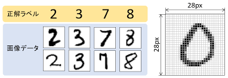
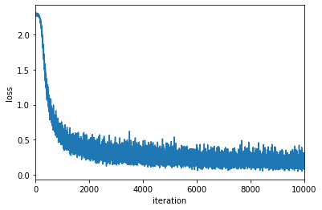
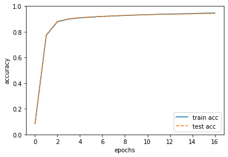

<!--
_class: title
_paginate: false
-->

# ミニバッチ学習の実装

### mono

---

## ミニバッチ学習

- ミニバッチ：訓練データから無作為に取り出した一部のデータ
- TwoLayerNet クラスを対象に、MNIST データセットを用いて学習

#### 学習の手順(1~3 の繰り返し)

1. ミニバッチ
1. 勾配の算出
1. パラメータの更新

---

## MNIST データセット

- 機械学習の分野で最も有名なデータセットのひとつ
- 0 から 9 までの数字画像から構成
- 訓練画像 60,000 枚、テスト画像 10,000 枚
- 画像データは一次元配列で各ピクセル 0 から 1 まで値を取る
  

---

## ミニバッチ学習の実装

```python
(x_train, t_train), (x_test, t_test) = load_mnist(normalize=True, one_hot_label=True)

network = TwoLayerNet(input_size=784, hidden_size=50, output_size=10)

iters_num = 10000  # 繰り返しの回数を適宜設定する
train_size = x_train.shape[0]
batch_size = 100
learning_rate = 0.1
#損失関数を記録する配列
train_loss_list = []
```

---

## ミニバッチ学習の実装

```python
for i in range(iters_num):
    batch_mask = np.random.choice(train_size, batch_size)
    x_batch = x_train[batch_mask]
    t_batch = t_train[batch_mask]
    # 勾配の計算
    #grad = network.numerical_gradient(x_batch, t_batch)
    grad = network.gradient(x_batch, t_batch)
    # パラメータの更新
    for key in ('W1', 'b1', 'W2', 'b2'):
        network.params[key] -= learning_rate * grad[key]
    loss = network.loss(x_batch, t_batch)
    train_loss_list.append(loss)
```

---

## ミニバッチ学習の実装

```python
a=np.array([0,10,20,30,40,50,60,70,80,90,100])
print(a[[0,3,5]]) #[ 0 30 50]
```

---

## 損失関数の推移の表示

```python
x = np.arange(len(train_loss_list))
plt.plot(x, train_loss_list, label='train acc')
plt.xlabel("iteration")
plt.ylabel("loss")
plt.xlim(0, 10000)
plt.show()
```



---

## テストデータで評価

- 損失関数の値の減少は学習が上手くいってるサインの 1 つ
  - 「訓練データのミニバッチに対する損失関数」
  - 他のデータでも同じ実力を発揮できるのか？
- 過学習
  - 訓練データに含まれるものは見分けられるがほかのデータは認識できなくなってしまうこと

---

## 汎化能力

- 汎：広く行き渡る（例：汎用性）
- 未知のテストデータに対する識別能力

#### 汎化能力を評価できるようにしたい！

- 定期的に訓練データとテストデータを対象に認識精度を記録
  - 今回は 1 エポックごと

---

## エポック（epoch）

学習において訓練データをすべて使い切ったときの回数

- 訓練データ 10000、ミニバッチのサイズが 100 の場合
  - 1 回のパラメータの更新で 100 個のデータを使う
  - 100 回行うとすべてのデータを使ったことになる
  - 1 エポック=100 回

---

## ミニバッチ学習の実装（変更部分）

- train_acc_lis：訓練データの認識精度
- test_acc_list：テストデータの認識精度
- iter_per_epoch：1 エポックの値

```python
train_acc_list = []
test_acc_list = []
iter_per_epoch = max(train_size / batch_size, 1)
```

---

## ミニバッチ学習の実装（変更部分）

- 1 エポックごとに認識精度を記録、出力

```python
if i % iter_per_epoch == 0:
        train_acc = network.accuracy(x_train, t_train)
        test_acc = network.accuracy(x_test, t_test)
        train_acc_list.append(train_acc)
        test_acc_list.append(test_acc)
        print("train acc, test acc | " + str(train_acc) + ", " + str(test_acc))
"""
train acc, test acc | 0.08493333333333333, 0.0877
train acc, test acc | 0.7727666666666667, 0.7765
train acc, test acc | 0.8788166666666667, 0.8822
・
・
・
"""
```

---

## 認識精度の推移の図示

```python
# グラフの描画
markers = {'train': 'o', 'test': 's'}
x = np.arange(len(train_acc_list))
plt.plot(x, train_acc_list, label='train acc')
plt.plot(x, test_acc_list, label='test acc', linestyle='--')
plt.xlabel("epochs")
plt.ylabel("accuracy")
plt.ylim(0, 1.0)
plt.legend(loc='lower right')
plt.show()
```

---

## 認識精度の推移の図示


学習が進むにつれて訓練データ、テストデータの認識精度は上昇。
2 つの認識精度に差はほぼない
→ 過学習が起きていない！

---

## 演習問題？

- パラメーターを変えて実行してみよう
- iters_num とか batch_size とか learning_rate とか
- ちょっといじったら認識精度 97%以上出るようになった

---

## まとめ

- NN が学習をするために「損失関数」という指標を導入
- 損失関数が最も小さくなるような重みを探す
  - これが NN の学習の目標
- 損失関数を小さくするための手法として勾配法がある
